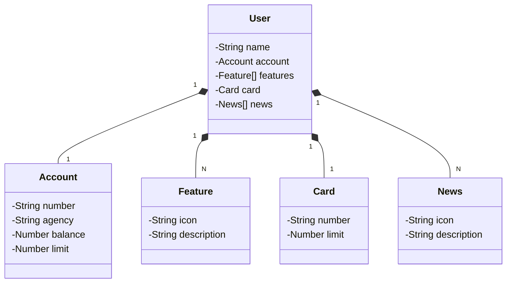

# Bank - API

Java RESTful API.

## Main Technologies
- **Java 17**: Using the most recent LTS version of Java, allowing us to leverage the latest innovations provided by this robust and widely-used language.
- **Spring Boot 3**: This project utilizes the latest version of Spring Boot, maximizing developer productivity through its powerful autoconfiguration capabilities.
- **Spring Data JPA**: We will simplify the data access layer using Spring Data JPA, making integration with SQL databases seamless.
- **OpenAPI (Swagger)**: The API documentation is created using OpenAPI (Swagger), ensuring clarity and ease of understanding, aligned with Spring Boot's productivity.
- **Railway**: Deployment and monitoring of cloud solutions are facilitated by Railway, which also offers various databases as a service and CI/CD pipelines.

## Figma Design
The project domain was abstracted and designed using Figma, helping with the analysis and solution design.

[Link to Figma Design](https://www.figma.com/file/0ZsjwjsYlYd3timxqMWlbj/SANTANDER---Projeto-Web%2FMobile?type=design&node-id=1421%3A432&mode=design&t=6dPQuerScEQH0zAn-1)

## Class Diagram (API Domain)

